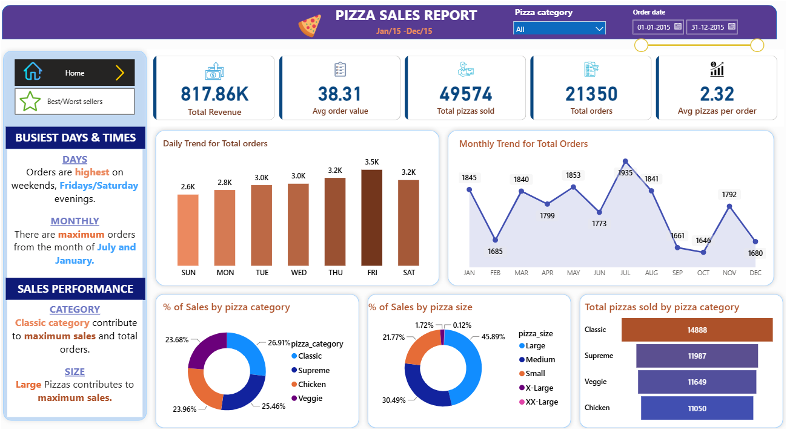
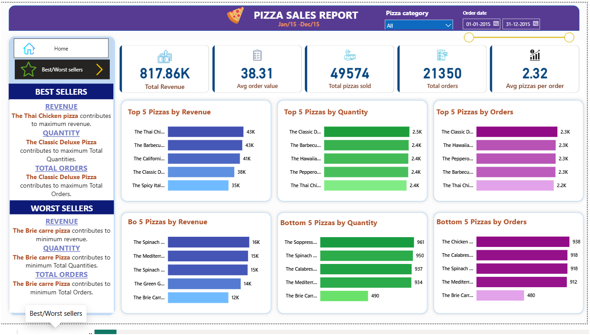

# pizza-sales-analysis
This repository showcases detailed sales analytics project that leverages MS SQL Server and Power BI to analyze pizza sales data and generate actionable business insights.

## Dashboard Overview

### Sales Performance Dashboard

### Best & Worst Sellers Dashboard

## Project Overview

The project analyzes one year of pizza sales data to identify:

- Revenue trends
- Customer ordering behavior
- Peak business days and months
- Best-selling pizzas
- Worst-selling pizzas
- Category-wise performance
- Pizza size contribution
- 
## Tech Stack

- MS SQL Server
- Power BI

## Dashboard Highlights

### KPIs

- Total Revenue
- Average Order Value
- Total Orders
- Total Pizzas Sold
- Average Pizzas per Order

### Sales Analysis

- Daily Sales Trend
- Monthly Sales Trend
- Revenue by Pizza Category
- Sales by Pizza Size
- Category-wise Orders

### Product Analysis

- Top 5 Pizzas by Revenue
- Top 5 Pizzas by Quantity
- Top 5 Pizzas by Orders
- Bottom 5 Pizzas by Revenue
- Bottom 5 Pizzas by Quantity
- Bottom 5 Pizzas by Orders

## Business Insights

- Classic pizzas generated the highest overall revenue.
- Large-sized pizzas contributed the largest share of sales.
- Friday evenings and weekends experienced peak order volumes.
- July recorded the highest monthly order count.
- The dashboard highlights both best-performing and underperforming products to support inventory and marketing decisions.

## Skills Demonstrated

- SQL Querying
- Data Cleaning
- KPI Development
- Power BI Dashboard Design
- Data Visualization
- Business Intelligence
